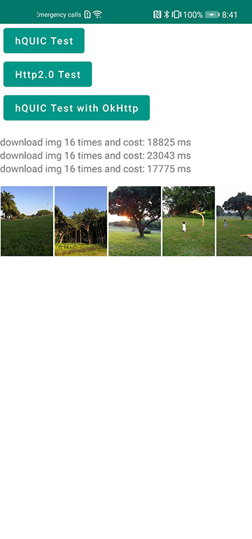

HUAWEI Awareness Kit Demo
=====

hQUIC Kit gives your apps low latency, high throughput, and secure and reliable communications capabilities. 
It supports the gQUIC protocol and provides intelligent congestion control algorithms 
to avoid congestions in different network environments, giving your apps faster connection establishment, reduced packet loss, and higher throughput.

#What you can try out
---------------------

    

Advantages
------------
- Ease of use: Streamlines APIs and shields low-level network details.
- High compatibility: Supports gQUIC and Cronet.
- Better experience: Outperforms other protocols in poor network conditions.

Requirements
------------

 - [Android SDK](http://developer.android.com/sdk/index.html).
 - Android [7.0 (API 24) ](http://developer.android.com/tools/revisions/platforms.html#7.0).
 - Android SDK Tools
 - Android SDK Build tools 29.0.3
 - Android Support Repository
 - Android Support libraries
 - HMS hQUIC Kit Library

Reference
------------

 - [Huawei hQUIC Kit](https://developer.huawei.com/consumer/en/doc/development/HMSCore-Guides/introduction-0000001050440045)
 
 
Building
--------

To build, install and run a debug version, run this from the root of the project:

    ./gradlew app:assembleDebug